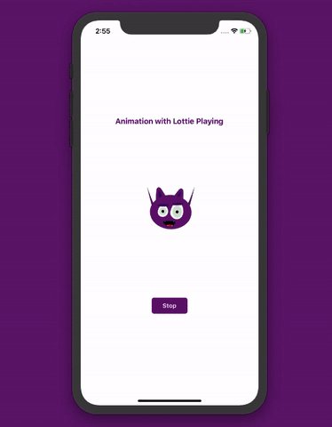

# Lottie React Native

Simple exemplo da biblioteca [Lottie](https://github.com/react-native-community/lottie-react-native) para utilizar animações feitas com Adobe After Affects e exportadas em `json` no IOS e Android.

